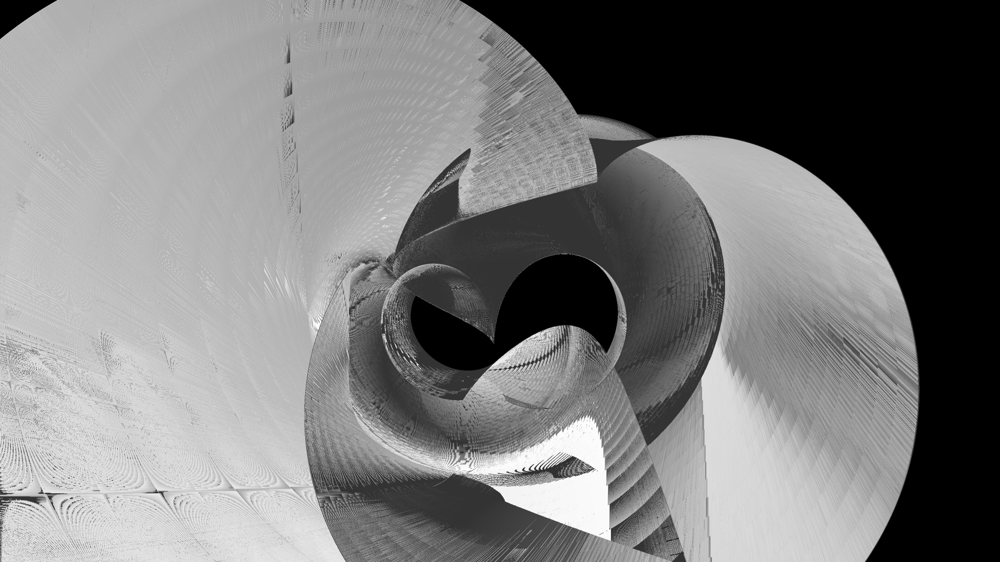
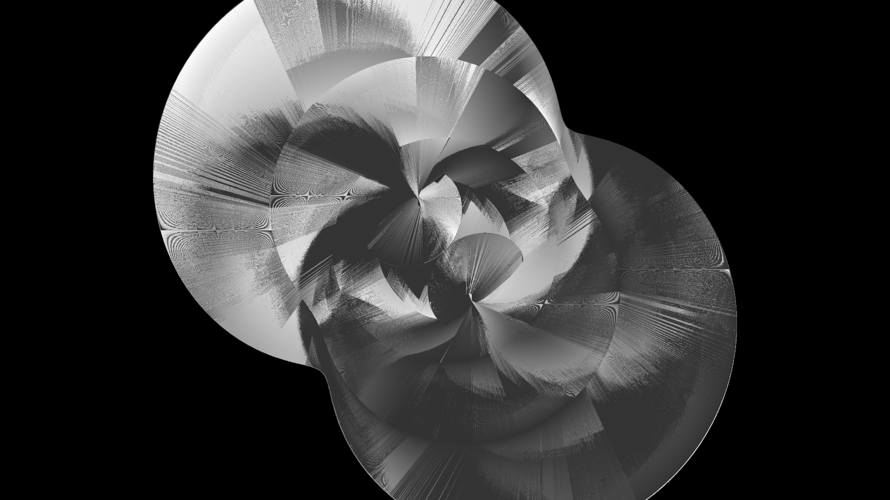

# Bezier-Based CPU Tube Renderer

A professional-grade, high-performance 3D software rendering engine written in C. This project implements a full custom graphics pipeline from scratch, optimizing for CPU-bound environments. It features volumetric extrusion, multithreaded rasterization, shadow mapping, and a configurable projection system.

-----

## Renders Produced

\
\
\

-----

## Architecture Overview

The system is designed as a modular pipeline where data flows from abstract mathematical definitions to a discrete pixel grid.

  * **[`types.h`](./files/include/types.h)**: Defines the core data structures (`Vec3`, `Mat4`, `AABB`) and engine constants.
  * **[`main.c`](./files/src/main.c)**: Command-line interface, system initialization, and the final output upscaling routine.
  * **[`geometry.c`](./files/src/geometry.c)**: Implementation of Cubic Bezier evaluation and local coordinate frame (Frenet-Serret) generation.
  * **[`scene.c`](./files/src/scene.c)**: Orchestrates thread management (`pthreads`) and high-level pass logic (Shadow Pass vs. Render Pass).
  * **[`renderer.c`](./files/src/renderer.c)**: The rasterization engine, managing scanline filling, Gouraud shading, and shadow depth-testing.
  * **[`math.c`](./files/src/math.c)**: Linear algebra suite including matrix multiplication, vertex transformation, and frustum culling logic.

-----

## Technical Deep-Dive & Code Walkthrough

### 1\. Geometry Generation & The Bezier Logic [`geometry.c`](./files/src/geometry.c))

The engine does not store static meshes. Instead, it extrudes geometry along a **Cubic Bezier Curve**.

A Bezier curve is defined by four points: $P_0, P_1, P_2, P_3$. The function `bezier_eval` calculates the 3D position at any time $t \in [0, 1]$ using Bernstein polynomials.
```c
// Evaluates the cubic spline at time t [0,1]
Vec3 bezier_eval(BezierCubic b, float t){
    float u = 1.0f - t;
    // Bernstein Polynomials
    Vec3 result = {
        u*u*u*b.p0.x + 3*u*u*t*b.p1.x + 3*u*t*t*b.p2.x + t*t*t*b.p3.x,
        u*u*u*b.p0.y + 3*u*u*t*b.p1.y + 3*u*t*t*b.p2.y + t*t*t*b.p3.y,
        u*u*u*b.p0.z + 3*u*u*t*b.p1.z + 3*u*t*t*b.p2.z + t*t*t*b.p3.z
    };
    return result;
}
```

To create a tube, we need more than just a point; we need an orientation. In [`geometry.c`](./files/src/geometry.c), the `bezier_tangent` function calculates the first derivative of the curve. This tangent acts as the "forward" vector for the tube.

By taking the cross product of the tangent and an arbitrary up-vector, we generate a **local coordinate frame** at every segment. This allows the engine to rotate a 2D circle of vertices (the "ring") so it is always perpendicular to the path, preventing the tube from appearing "flat" or distorted as the curve twists.

### 2\. Multi-Core Threading & Job Dispatch ([`scene.c`](/files/src/scene.c))

Because software rasterization is computationally heavy, [`scene.c`](./files/src/scene.c) utilizes a **Data-Parallel** architecture.

The engine divides the total `tube_count` into $N$ equal slices (where $N$ is `NUM_THREADS`). Each thread is responsible for its own geometry.

```c
// Creating thread jobs to saturate the CPU
int per = scene.tube_count / NUM_THREADS;
for(int t=0; t < NUM_THREADS; t++){
    jobs[t].start = t * per;
    jobs[t].end   = (t == NUM_THREADS-1) ? scene.tube_count : (t+1)*per;
    
    // Spawn the thread to handle its slice of the geometry
    pthread_create(&threads[t], NULL, render_thread_func, &jobs[t]);
}
```

  * **The Shadow Pass**: All threads render their geometry from the perspective of the light source into the `shadow_map`.
  * **The Render Pass**: All threads render from the camera perspective, performing depth-tests against the shared `zbuffer` and occlusion-tests against the `shadow_map`.

### 3\. Frustum Culling ([`math.c`](./files/src/math.c))

To maintain performance with 10+ million tubes, we must cull geometry that is not visible to the camera.

Each tube is wrapped in an **AABB (Axis-Aligned Bounding Box)**. In [`math.c`](./files/src/math.c), the function `aabb_in_frustum` projects the eight corners of this box into Clip Space using the View-Projection matrix. If all corners fall outside the frustum planes, the thread skips the tube entirely, saving millions of unnecessary vertex and pixel calculations.

```c
// Only render if the bounding box intersects the camera view
int aabb_in_frustum(AABB box, Mat4 mvp){
    for(int i = 0; i < 8; i++){
        Vec4 v = {corners[i].x, corners[i].y, corners[i].z, 1.0f};
        Vec4 c = mat4_mul_vec4(mvp, v); // Transform to Clip Space

        if(c.w > 0){
            float nx = c.x / c.w; float ny = c.y / c.w; float nz = c.z / c.w;
            if(nx >= -1 && nx <= 1 && ny >= -1 && ny <= 1 && nz >= 0 && nz <= 1.1f)
                return 1; // At least one corner is visible
        }
    }
    return 0; // Completely off-screen
}
```

### 4\. Rasterization & Shading ([`renderer.c`](./files/src/renderer.c))

Once geometry is projected onto the 2D screen, [`renderer.c`](./files/src/renderer.c) fills the resulting triangles using a **Scanline Rasterizer**.

The engine uses **Gouraud Shading**: lighting is calculated at the vertices and then linearly interpolated across the face of the triangle. For every pixel:

1.  **Z-Buffer Test**: We compare the pixel's depth against `zbuffer[y][x]`. If it is closer than the existing pixel, we proceed.
2.  **Shadow Map Test**: We re-project the pixel's world-space position into the light's view space. We compare its depth against the value in the `shadow_map`. If the pixel's depth is greater (with a small bias), it is marked as "in shadow" and darkened.
```c
// Inside the rasterization loop for every pixel
if (z < zbuffer[y][x]) { 
    zbuffer[y][x] = z; // Depth test: current pixel is closer

    // Project world position into Light-Space to check for shadows
    Vec4 lp = mat4_mul_vec4(light_vp_global, (Vec4){wx, wy, wz, 1.0f});
    float depth_in_shadow_map = shadow_map[sm_y][sm_x];
    
    if (dist_to_light > depth_in_shadow_map + 0.05f) {
        intensity *= 0.3f; // Pixel is occluded by another object
    }
}
```

-----

## CLI Reference

### Geometry Parameters

  * `-t <int>`: Total number of tubes to render (e.g., `10000000`).
  * `-seg <int>`: Longitudinal segments per tube. Higher values make the curves smoother.
  * `-sid <int>`: Radial sides per tube. `3` = triangular tube, `12`+ = smooth cylinder.
  * `-r <float>`: Tube radius (thickness).
  * `-scale <float>`: Global scale of the scene.

### Bezier Control Points

  * `-p0 <x,y,z>`: The origin point of the spline.
  * `-p1 <x,y,z>`: The first control point (influences curve exit).
  * `-p2 <x,y,z>`: The second control point (influences curve entry).
  * `-p3 <x,y,z>`: The destination point of the spline.

### Transformations & Animation

  * `-rx, -ry, -rz <float>`: Rotation multipliers for the model matrix.
  * `-rcx, -rcy, -rcz <float>`: Constant rotation offsets (static rotation).
  * `-as <float>`: Animation step. Increment applied to rotation per frame.
  * `-tx, -ty, -tz <float>`: Global translation (positioning the model in world space).
  * `-mtx, -mty, -mtz <float>`: Multipliers for position translation.
  * `-ts <float>`: Translation step for procedural offsets.

### Camera & Lighting

  * `-cx, -cy, -cz <float>`: Camera position in world space.
  * `-fov <float>`: Field of View in degrees.
  * `-focus <x,y,z>`: Sets the camera's LookAt target.
  * `-lx, -ly, -lz <float>`: Position of the point light source (affects shadows and shading).

### Shading & Output

  * `-rgb`: Enables rainbow-cycling colors based on tube index.
  * `-color <r,g,b>`: Sets a static color (e.g., `255,128,0`).
  * `-o <string>`: Output filename (default: `output.ppm`).
  * `-ow, -oh <int>`: Final output resolution (upscaled).

-----

## Build Instructions

The engine is written in standard C99 and requires a compiler with `pthread` support.

```bash
gcc -O3 -march=native -ffast-math -funroll-loops -flto \
-pthread main.c scene.c renderer.c geometry.c math.c -lm -o renderer
```

**Compile Flags:**

  * `-O3`: Maximum optimization.
  * `-march=native`: Optimizes the binary for your specific CPU (utilizing AVX/SSE).
  * `-ffast-math`: Allows the compiler to break IEEE floating-point compliance for speed.
  * `-flto`: Link-time optimization to inline functions across different `.c` files.

-----

## License

Provided as an open-source reference for high-performance software rendering. No bullshit.
